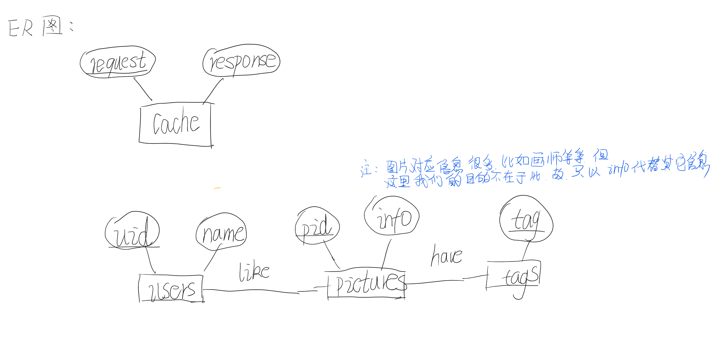

# 实验5 数据库设计 

## （1）实验目的

掌握数据库设计基本方法及数据库设计工具。 

## （2）实验内容和要求

掌握数据库设计基本步骤，包括数据库概念结构设计、逻辑结构设计，物理结构设计，数据库模式SQL语句生成。能够使用数据库设计工具进行数据库设计。 

## （3）实验重点和难点

实验重点：概念结构设计、逻辑结构设计。 

实验难点：逻辑结构设计。逻辑结构设计虽然可以按照一定的规则从概念结构转换而来，但是由于概念结构通常比较抽象，较少考虑更多细节，因此转换而成的逻辑结构还需要进一步调整和优化。逻辑结构承接概念结构和物理结构，处于核心地位，因而是数据库设计的重点，也是难点。

## （4）实验过程

### 需求分析

> 背景提要：在实际生活中数据库有着多种用途，可以为公司企业管理数据服务，也可以用于个人数据储存，这里以最近在写的一个看图应用中使用的数据库为例来完成这次实验，由于数据是针对个人的没有聚总的必要，应用中没有使用像MySQL等服务器和客户端分离的数据库而是选择使用了嵌入式的SQLite3，这次实验仍然使用MySQL来模拟实际运行。

该看图应用使用数据库有两个需求，一是作为一个方便管理的数据缓存，因为浏览图片每次都需要获取服务端反馈，用户可能在一次使用时重复查看同样内容，处于速度和流量方面的考虑，我们将服务端的反馈和请求存入数据库，在应用的一次使用过程中当发现数据库中已经有一个请求的缓存，那么我们就不再去服务端请求而直接使用本地的缓存反馈。二是储存用户的一些使用记录，比如收藏了某张图片，查看过某张图片等等，同时图片也有一些属性比如标签，我们需要根据记录分析出用户可能会喜欢的标签。

```XML
<post id="396376" tags="business_suit heels saitou_yuu tagme" created_at="1497178221" updated_at="1497178224" creator_id="175701" approver_id="" author="saemonnokami" change="2091627" source="https://twitter.com/54110yu/status/855379185367252992" score="0" md5="1d8fbc43e00e7edd2fd6992468172e26" file_size="180244" file_ext="jpg" file_url="https://files.yande.re/image/1d8fbc43e00e7edd2fd6992468172e26/yande.re%20396376%20business_suit%20heels%20saitou_yuu%20tagme.jpg" is_shown_in_index="true" preview_url="https://assets.yande.re/data/preview/1d/8f/1d8fbc43e00e7edd2fd6992468172e26.jpg" preview_width="105" preview_height="150" actual_preview_width="209" actual_preview_height="300" sample_url="https://files.yande.re/sample/1d8fbc43e00e7edd2fd6992468172e26/yande.re%20396376%20sample%20business_suit%20heels%20saitou_yuu%20tagme.jpg" sample_width="1047" sample_height="1500" sample_file_size="196541" jpeg_url="https://files.yande.re/image/1d8fbc43e00e7edd2fd6992468172e26/yande.re%20396376%20business_suit%20heels%20saitou_yuu%20tagme.jpg" jpeg_width="1256" jpeg_height="1800" jpeg_file_size="0" rating="s" is_rating_locked="false" has_children="false" parent_id="" status="active" is_pending="false" width="1256" height="1800" is_held="false" frames_pending_string="" frames_string="" is_note_locked="false" last_noted_at="0" last_commented_at="0"/>
```
上文为服务器返回的对于一张图片的单条XML数据，由于是模拟运行在本次实验中对于图片部分并不会存所有的数据项，具体可以参考下面的概念数据库设计。

### 概念数据库设计

根据以上分析，再次分析我们的需求，图片对应的部分信息在本次实验中是不重要的，所以这里将其他信息统计合并为`info`一项。绘制出全局ER图如下


### 逻辑数据库设计

根据上述UR图我们可以运用课本所学知识转化设计出具体的数据库，如下：
```SQL
-- CREATE A cache table
CREATE Table cache(
    -- request is store a url, in comman case it will not hava 100 more char
    request     CHAR( 100 ) PRIMARY KEY NOT NULL, 
    -- respose is store a XML string from server, in commen case it will be 100000 char 
    response    TEXT);

-- CREATE　other　table
CREATE Table Users(
    uid     CHAR( 20 ) PRIMARY KEY NOT NULL,
    name    CHAR( 30 ))
    ENGINE=InnoDB;
CREATE Table Pictures(
    pid     CHAR( 20 ) PRIMARY KEY NOT NULL,
    info    TEXT)
    ENGINE=InnoDB;
CREATE Table Tags(
    tag     CHAR( 20 ) PRIMARY KEY NOT NULL);
CREATE Table Likes(
    uid     CHAR( 20 ) NOT NULL,
    pid     CHAR( 20 ) NOT NULL,
    PRIMARY KEY (uid, pid),
    FOREIGN KEY(uid) REFERENCES Users(uid),
    FOREIGN KEY(pid) REFERENCES Pictures(pid))
    ENGINE=InnoDB;
CREATE Table Has(
    pid     CHAR( 20 ),
    tag     CHAR( 20 ),
    PRIMARY KEY (pid, tag),
    FOREIGN KEY(pid) REFERENCES Pictures(pid),
    FOREIGN KEY(tag) REFERENCES Tags(tag));
```
### 模式细化

上书提到的是较为靠后的版本，实际上最开始是打算将`tag`作为`Pictures`的一个属性的，但是这样会引起查询和使用上的不方便，因为一张图片可能有多个`tag`，最后决定将`tag`移出来单独作为一个表格。

### 物理数据库设计

根据我们的经常使用的查询，可以在在`cache`和其他单项表格的主属性建立索引。
```SQL
-- Index
CREATE Index cache_request_index ON cache(request);
CREATE Index Users_uid_request_index ON Users(uid);
CREATE Index Pictures_pid_index ON Pictures(pid);
CREATE Index Tags_tag_index ON Tags(tag);
```

### 应用于安全设计

在一开就已经提到，本次实验是使用MySQL来模拟另外编写的应用中的使用数据库的部分，由于该部分是已经编译成二进制代码后的，因此普通用户是没办法使用和修改的，因而没有用户角色上的问题，关于数据安全方面，同样又由于上述原因，具体使用的时候是在编写程序时在程序内部，有编写的程序员来负责其安全性。

## （5）实验结果

本次实验已经解决一开始提到的两个需求，比如查询是否有缓存的语句如下：
```SQL
-- SELECT the request
SELECT c.response
    FROM cache c
    WHERE c.request = "https://yande.re/post.xml?limit=100&page=1";
```
我们也可以通过连接很方便的查询对应用户喜欢的图片的标签，美中不足的是这里并没有使用实际的数据而是用简单的样例来模拟，因而无法反应出效率相关的问题。

## （6）实验心得

实验中遇到最难的问题有两个，一是开头，不知道这次实验具体是要做什么，很多同学都借鉴往年师兄师姐的代码就将上去，一番思考最后还是决定自己动手，所以选择自己之前再写的项目中使用到的数据库部分，也正因为如此，数据样例等方面都有些问题。二是关于外键约束，讲道理课本上的写法和MySQL的语法有微妙的差别，就这一点差别就卡了我很久，最后还是静下心来好好看了对应官方文档从新抽出其中的部分来实践一番。说实话MySQL官方的文档没有看完，师兄/师姐的代码里面很多语法我都看不懂，本次实验是在命令行就完成了的，也不知道以后用MySQL的机会多不多所以还是设计这个过程最重要。