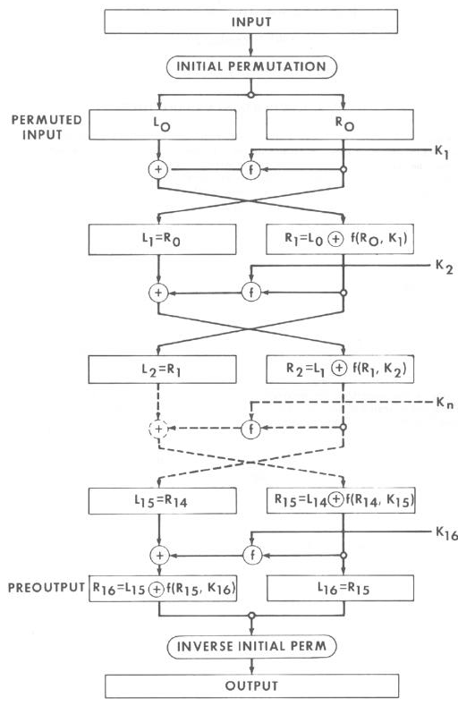

# Data Encryption Standard (DES)
`jskyzero` `2017/10/02`

[](https://travis-ci.org/jskyzero/DES)
[](https://github.com/dwyl/esta/issues)

## Overview
The Data Encryption Standard (DES) is a block cipher (a form of shared secret encryption) that was selected by the National Bureau of Standards as an official Federal Information Processing Standard (FIPS) for the United States in 1976 and which has subsequently enjoyed widespread use internationally. It is based on a symmetric-key algorithm that uses a 56-bit key.

This implementation wants to make the DES more readable and more structured, I refered some other's implementation like [github/tarequeh/DES](https://github.com/tarequeh/DES).

Padding scheme used in this implementation is [PKCS5]

If you can read Chinese, you can read the More Things part.

## Compilation & Installation

1. Please Make sure you have C Language environment, for example `gcc`and `make`
2. Compilation using:
    ```
    make
    ```
    Then you can find the `des` executable file in `./bin` folder.

## Usage
> I keep the same usage like tarequeh's DES implementation

Say we want to encrypt/ decrypt a file named /home/user/sample.txt

1. Generate a keyfile using:

   ```
   ./bin/des -g /tmp/keyfile.key
   ```

2. Encrypt sample.txt using:

   ```
   ./bin/des -e /tmp/keyfile.key /home/user/sample.txt /home/user/sample.enc
   ```

3. Decrypt sample.txt using:

   ```
   ./bin/des -d /tmp/keyfile.key /home/user/sample.enc /home/user/sample_decrypted.txt
   ```

Don't lose the key file! you won't be able to decrypt an encrypted if you lose the keyfile.


## More Things
+ 本项目将用C实现DES(一种对称密匙块加密算法)
+ 为什么有这个项目？
  + 实现过一次以后对原理的印象会更加深刻。
  + 实现的成品也可以拿来实际加密用。
+ 什么是DES？
  + DES是一种对称加密算法，指加密和解密使用相同的密匙。
  + DES是一种快加密算法，指将明文分区段，并对每一个区段用相同的演算法则和钥匙。
  + DES现在已经不被视为一种安全的加密算法，2001年被高级加密标准（AES）取代。
+ DES算法概要
  + DES 是一种典型的块加密方法:它以64位为分组长度,64位一组的明文作为算法的输入通过一系列复杂的操作,输出同样64位长度的密文。
  + DES 使用加密密钥定义变换过程。
  + DES 的采用64位密钥,但由于每8位中的最后1位用于奇偶校验,实际有效密钥长度为56位。密钥可以是任意的56位的数,且可随时改变。其中极少量的数被认为是弱密钥,但能容易地避开它们。所有的保密性依赖于密钥。
  + DES 算法的基本过程是换位和置换。（具体的操作将在下文模块部分提到）
+ 项目结构
  ```
  .
  ├── bin         // 执行文件
  ├── build       // 中间生成文件
  ├── docs        // 文档
  ├── include     // 头文件
  ├── LICENSE     // 证书
  ├── makefile    // 生成执行文件脚本
  ├── README.md   // 说明文件
  └── src         // 源代码
  ```
+ 流程概述
  + 大致处理流程如图所示
  + 图一是总体流程，首先先进行一次变换，和这次变换对应的一次最后输出前有一次逆变换。
  + 处理过程就是交换左右，右边的和常量进行一些复杂的异或运算。
  + 最后交换左右输出

  + 关于密匙生成，就是把有效位分成两部分，循环移位。
  + 然后按照给出的方法进行变换

+ 模块分解
  + 接受参数的外壳模块
  + 密匙的生成/存取模块
  + 输入输入的读写模块
  + 公用的定义/函数模块
  + 核心的块加密模块
+ 数据结构
  + DES中没有复杂的数据需要什么特殊结构，用数组足矣。
  + 关于数据类型，这里选用`uint8_t`和`uint64_t`。
+ 类C语言算法算法过程
  ```C
  // 这里省略了冗杂部分，尽量描述核心逻辑
  // block -> 加密单元
  // keys  -> 子密匙串

  // 初次变换
  INITIAL_PERMUTATION(block);
  // 16次迭代，解密的话是反向
  LOOP i from 1 to 16:
    block => left, right;
    new_left = right;
    // 密匙是48位，32位的right需要先扩充映射
    // f 指 使用 S-Box 生成的feistel函数
    new_right = left ^ f(keys[i] ^ extend(right));
    left, right => block
  END
  // 交换左右输出
  block => left, right;
  right, left => block
  // 反向变换
  INVERSE_INITIAL_PERMUTATIN(block);
  ```

## Reference
+ [FIPS 46-3, Data Encryption Standard (DES) (withdrawn May 19, 2005)](docs/FIPS 46-3, Data Encryption Standard (DES) (withdrawn May 19, 2005).pdf)
+ [Data Encryption Standard (Wikipedia)](https://en.wikipedia.org/wiki/Data_Encryption_Standard)
+ [DES supplementary material (Wikipedia)](https://en.wikipedia.org/wiki/DES_supplementary_material)
+ [github/tarequeh/DES](https://github.com/tarequeh/DES)